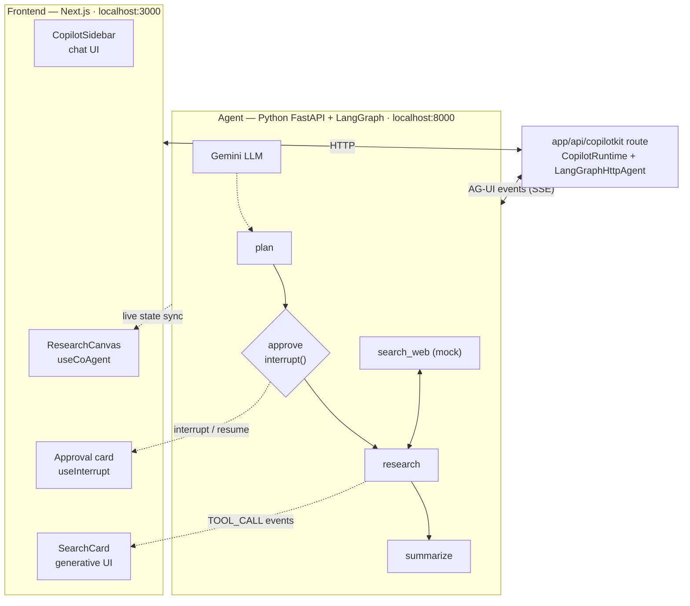

# Research Assistant - CopilotKit + LangGraph (Python)

A proof-of-concept agent-native app: a **LangGraph research agent** (Python, Gemini) with a **CopilotKit frontend** (Next.js), connected over the **AG-UI protocol**.

Ask for any topic in the chat sidebar and the agent drafts a 3-step research plan, **asks for your approval**, runs mock web searches, and delivers findings and a summary — with its internal state rendered **live** on the page.

## Features demonstrated

| Feature | Where to see it |
|---|---|
| **Shared state** (`useCoAgent`) | The canvas card — topic, pipeline stages, plan, findings, and summary stream in live from the agent's LangGraph state |
| **Generative UI** (`useCopilotAction` render) | 🔍 SearchCard components render in chat as the agent calls its `search_web` tool |
| **Human-in-the-loop** (`interrupt()` + `useInterrupt`) | The agent pauses after planning; an approval card with Approve/Reject buttons appears in chat |
| **Graceful failures** | LLM errors (e.g. Gemini quota) end the run with a polite chat message and a red canvas badge instead of a dead stream |

## Architecture



The graph state (`topic`, `plan`, `status`, `findings`, `summary`) syncs to the frontend automatically; `copilotkit_emit_state` pushes mid-node updates so the canvas animates in real time.

## Setup

**Prerequisites:** Python 3.11+, Node.js 20+, a [Gemini API key](https://aistudio.google.com/apikey) (free tier works).

### 1. Backend

```bash
python3 -m venv .venv
.venv/bin/pip install -r agent/requirements.txt
cp agent/.env.example agent/.env    
```

### 2. Frontend

```bash
cd frontend
npm install
```

## Run

Two terminals:

```bash
cd agent && ../.venv/bin/python main.py
```

```bash
cd frontend && npm run dev
```

Open **http://localhost:3000**, then try: *"Research the history of coffee"*.

Health check: `curl http://localhost:8000/health` → `{"status":"ok"}`.

## Gemini free-tier quota — read this

The free tier allows only **~20 requests/day per model name**, and one research run costs **~5-6 requests** (plan + research with tool loop + summary). When you hit a 429, the agent tells you in chat. The `-latest` aliases draw from **separate quota buckets**, so you can hop models in `agent/.env`:


The agent auto-reloads when `.env` changes are saved and the server restarts (uvicorn `--reload` watches `.py` files; restart manually after editing only `.env`).

## Project layout

```
agent/
  agent.py            # LangGraph graph, nodes, tool, error handling
  main.py             # FastAPI + AG-UI endpoint
  requirements.txt
  .env                # GOOGLE_API_KEY, optional GEMINI_MODEL
frontend/
  app/layout.tsx      # CopilotKit provider (agent="research_agent")
  app/page.tsx        # sidebar + useInterrupt + search_web renderer
  app/api/copilotkit/route.ts   # runtime → LangGraphHttpAgent bridge
  components/ResearchCanvas.tsx # useCoAgent live state canvas
  components/SearchCard.tsx     # generative UI card
```

## Upstream quirks this POC works around

These cost real debugging time — all workarounds live in `agent/agent.py`

1. **Metadata key mismatch between SDK layers.** `copilotkit_customize_config` sets `copilotkit:emit-messages`, but the base `ag-ui-langgraph` adapter reads `emit-messages`. Mixing silenced and streaming LLM calls in one run leaves a stale "message in progress" record, and the next streamed message dies with *"No active text message found"*. Workaround: `_silent_config()` sets **both** keys.
2. **`copilotkit_customize_config` mutates the config you pass in** (its metadata dict is shared, not copied) — silently tainting the node's own config. Workaround: `_silent_config()` builds a fresh config by hand.
3. **Gemini tool calls never stream.** The adapter only reads `tool_call_chunks` from streamed chunks; `langchain-google-genai` puts the call in `additional_kwargs.function_call` instead, so no TOOL_CALL events are emitted. Also, `copilotkit_emit_tool_call` is broken in 0.1.94 (its handler builds the events but never yields them). Workaround: dispatch the base adapter's `manually_emit_tool_call` custom event directly.
4. **`useInterrupt` (v2 hook) doesn't read the classic `<CopilotKit agent="...">` prop** — it defaults to an agent named `default`. Pass `agentId` explicitly.
5. **Interrupt payloads arrive JSON-stringified** — `parseApprovalPayload` handles both string and object forms.
6. Harmless log noise: `OnToolEnd received non-ToolMessage output ('str'); skipping dispatch` (our tool returns a plain string) and the Lit dev-mode banner.

## Troubleshooting

| Symptom | Cause / fix |
|---|---|
| quota message in chat | Daily Gemini quota for the current model — switch `GEMINI_MODEL` (see above) |
| `INCOMPLETE_STREAM` in browser console | Agent crashed mid-stream — check the uvicorn terminal for a traceback |
| Approval card says "unknown approval request" | Interrupt payload shape drifted from `parseApprovalPayload` in `app/page.tsx` — keep it in sync with `approve_node` |
| `Agent 'X' not found after runtime sync` | Agent name must match in **three** places: `LangGraphAGUIAgent(name=...)`, the runtime route's `agents` map, and the `<CopilotKit agent="...">` prop (+ `useInterrupt`'s `agentId`) |
| Frontend can't reach agent (`socket closed`) | Agent not running on port 8000, or `AGENT_URL` in `frontend/.env.local` is wrong |
